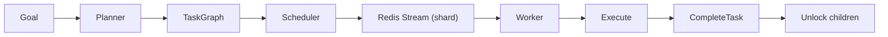

# Explain

Explain how a part of Astra works. The user describes what they want to understand after the command name (e.g. `how the scheduler detects ready tasks and dispatches them to workers`).

## Pre-requisites — Read Before Acting

1. Read `.cursor/skills/codebase-map/SKILL.md` for repo layout
2. Read `.cursor/skills/kernel-reference/SKILL.md` for kernel internals
3. Read `.cursor/skills/api-contract-reference/SKILL.md` for API contracts

## Approach

This is a read-only investigation. Do not modify any files.

### Step 1 — Identify the Scope

Map the user's question to the relevant part of the system:

| Topic | Key Files |
|-------|-----------|
| Actor runtime, mailboxes, supervision | `internal/actors/` |
| Agent lifecycle, AgentActor | `internal/agent/` |
| Task graphs, DAGs, state machine | `internal/tasks/` |
| Scheduling, sharding, ready-task detection | `internal/scheduler/` |
| Redis Streams, consumer groups | `internal/messaging/` |
| Event sourcing, event replay | `internal/events/` |
| Agent memory, embeddings, pgvector | `internal/memory/` |
| Tool sandbox, WASM/Docker/Firecracker | `internal/tools/` |
| Worker pool, heartbeats | `internal/workers/` |
| Evaluation, validators | `internal/evaluation/` |
| Planning, goal → DAG conversion | `internal/planner/` |
| gRPC API, protobuf contracts | `proto/`, `pkg/grpc/` |
| Database schema, migrations | `migrations/`, `.cursor/skills/db-schema-reference/` |
| Deployment, k8s, Helm | `deployments/` |
| Service entrypoints | `cmd/*/main.go` |

### Step 2 — Trace the Flow

Read the relevant source files and trace execution. Follow imports, method calls, and data transformations.

### Step 3 — Explain with Diagrams

Provide:

1. **Step-by-step explanation** with file references
2. **Data flow diagram** using Mermaid:

3. **Key types and interfaces** involved
4. **Configuration points** (env vars, config files)

## Output

### Overview
One paragraph summary.

### Data Flow
Mermaid diagram showing the flow.

### Step-by-Step
Numbered steps with file references.

### Key Files
Table of the most important files.

### Configuration
What can be changed via config or environment variables.
